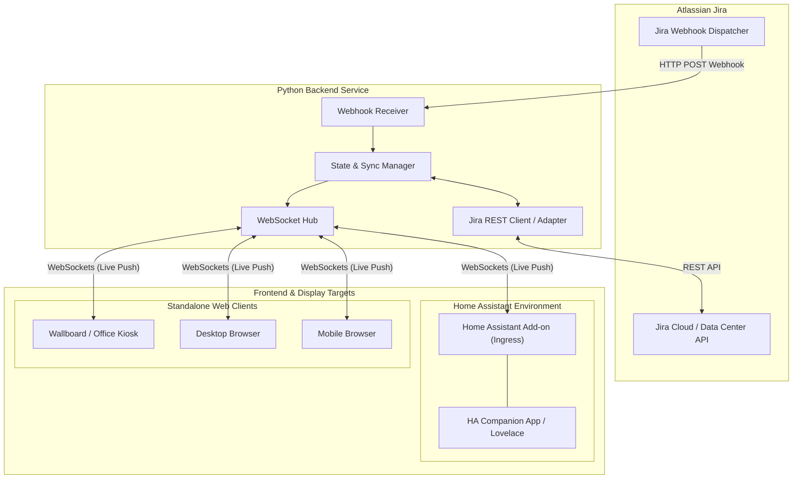

# Home Assistant Jira Dashboard

[](LICENSE)
[](#roadmap)
[](https://my.home-assistant.io/redirect/supervisor_add_addon_repository/?repository_url=https%3A%2F%2Fgithub.com%2Fjacek-marchwicki%2Fhomeassistant-jira)

A high-performance, real-time Jira dashboard built for **Home Assistant** and **standalone web environments**. Designed from the ground up for ambient wall displays, desk workflows, and mobile devices, providing instant UI feedback and live multi-client synchronization.

---

## 🌟 Highlights

- **Dual-Mode Deployment**:
  - **Home Assistant Add-on**: Native Ingress support for zero-config access inside Home Assistant OS, Lovelace panels, and the Home Assistant Companion mobile app.
  - **Standalone Web App**: Fully functional as an independent container or local service for desktop and mobile browsers.
- **Ultra-Responsive UI (Scalable Viewports)**:
  - Effortlessly scales from **large ambient wallboards / 4K displays** down to **compact mobile smartphones**.
  - Touch-optimized interfaces ($\ge 44 \times 44\text{ px}$ targets) with clear visual hierarchy.
- **Optimistic UI (Zero Perceptual Latency) & Offline Outbox**:
  - User actions (moving cards, reordering rank via drag-and-drop, transitioning statuses, editing fields, creating issues) update the interface immediately ($< 50\text{ms}$).
  - Dual-layer offline outbox queuing (client-side Zustand queue + backend SQLite persistent outbox) with automatic background synchronization, exponential backoff retries, and graceful rollback on rejection.
- **LexoRank Drag-and-Drop Issue Ranking**:
  - Natural vertical card reordering in both Kanban Board and Backlog views without card snapping or layout jumping.
  - Fractional alphanumeric LexoRank calculation for collision-free relative ordering, preserved across offline sessions and synced bi-directionally with Jira.
- **Installable Progressive Web App (PWA)**:
  - Installable in browsers on **Android** (Google Chrome, Samsung Internet, Edge, Brave), **iOS** (Safari), and **Desktop**.
  - Includes a Web App Manifest, Service Worker (`sw.js`) with app-shell caching, and adaptive Android maskable icons (192x192 and 512x512).
  - Built-in one-tap "Install App" prompt and touch-friendly mobile installation banner.
- **Real-Time Bidirectional Event Streaming**:
  - Python backend listens for incoming **Jira Webhooks** to capture external updates instantly.
  - Connected browsers receive delta updates in real time via **WebSockets**.
- **Tested & Engineered for Evolution**:
  - Adherence to Clean Architecture, strict typing, and comprehensive unit and integration test suites.

---

## 🛠️ Technology Stack (Phase 2)

See [**ADR-001: Technology Stack Selection**](file:///Users/jacek/Documents/apps/jacek-marchwicki/homeassistant-jira/docs/architecture_decision_records/ADR-001-technology-stack.md) for full context and architectural tradeoffs.

- **Backend** ([`backend/`](file:///Users/jacek/Documents/apps/jacek-marchwicki/homeassistant-jira/backend/)):
  - **Runtime & Framework**: Python 3.10+, **FastAPI**, **Uvicorn** (ASGI).
  - **Data Modeling & Validation**: **Pydantic v2** (Rust-accelerated serialization).
  - **Client**: **HTTPX** (Async HTTP for Jira Cloud REST API).
  - **Package Management & Tooling**: **uv**, **pyproject.toml**, **pytest**, **ruff**, **mypy**.
- **Frontend** ([`frontend/`](file:///Users/jacek/Documents/apps/jacek-marchwicki/homeassistant-jira/frontend/)):
  - **Core**: **React 19**, **TypeScript**, **Vite** (configured with relative `base: './'` for Ingress dynamic proxying).
  - **Styling & Theming**: **Tailwind CSS v4** + Design Tokens with Home Assistant CSS variable bridge.
  - **State & Optimistic Mutations**: **Zustand** (sub-50ms optimistic state updates with rollback queues).
  - **Drag & Drop**: **@dnd-kit** (accessible touch and pointer sensors across mobile, tablet, and PC).
  - **Icons**: **Lucide React**.
  - **Package Manager**: **pnpm**.

---

## 🎨 Design System

The dashboard implements a versatile design system designed for ambient wallboards, desktop monitors, and handheld mobile phones.
👉 [**Complete Design System Specification**](file:///Users/jacek/Documents/apps/jacek-marchwicki/homeassistant-jira/docs/design_system.md)

- **Dark-First Default**: Slate palettes optimized for high-contrast visibility and low-glare wall displays.
- **Home Assistant Theme Bridge**: Seamlessly inherits `--card-background-color`, `--primary-text-color`, and `--accent-color` when hosted in Ingress.
- **Dual Action Modality**: Drag-and-drop across all screens, plus direct one-tap "Mark as Done" buttons and status transition menus so dragging is never strictly required.
- **Touch-Friendly & Accessible**: Minimum $44 \times 44\text{ px}$ targets and dual-coded priority indicators (color + unique icon glyph).

---

## 🏛️ Architecture Overview

The system consists of a Python-based backend service and a modern reactive frontend web application.



---

## 📋 Business Requirements & User Scenarios

For the complete specification of personas, user stories, functional and non-functional requirements, see:
👉 [**Business Requirements Specification**](file:///Users/jacek/Documents/apps/jacek-marchwicki/homeassistant-jira/docs/business_requirements.md)

### Key Workflows:
1. **Ambient Kiosk**: Glancable sprint progress, visual blocker alerts, and touchless live updates for office displays.
2. **Focused Desk Worker**: Instant drag-and-drop issue transitions without the sluggishness of full Jira web pages.
3. **Mobile Triage**: Responsive single-column touch navigation resilient to intermittent connections.
4. **Team Standup**: Shared multi-client synchronization where moves made by any user or Jira automation reflect everywhere instantly.

---

---

## 🚀 Quick Start & Project Setup

### Prerequisites
- **Python**: 3.10 or higher (with [`uv`](https://github.com/astral-sh/uv) recommended, or `pip` / `venv`)
- **Node.js**: 20.x or 22.x
- **Package Manager**: [`pnpm`](https://pnpm.io/) (`corepack enable && corepack prepare pnpm@latest --activate` or `npx pnpm`)

### 1. Backend Setup
```bash
cd backend

# Option A: Using uv (Recommended)
uv sync

# Option B: Using standard Python venv
python3 -m venv .venv
source .venv/bin/activate
pip install --upgrade pip
pip install -e ".[dev]"
```

### 2. Frontend Setup
```bash
cd frontend

# Install dependencies using pnpm
pnpm install
```

---

## 🧪 Running Tests & Quality Checks

The codebase is tested across both the Python backend and TypeScript frontend.

### 1. Run Backend Tests
```bash
# Run with pytest
PYTHONPATH=backend/src pytest backend/tests

# Run with standard Python unittest runner
PYTHONPATH=backend/src python3 -m unittest discover -s backend/tests

# Lint and formatting check
ruff check backend/ scripts/
ruff format --check backend/ scripts/
```

### 2. Run Frontend Tests & Build
```bash
cd frontend

# Run unit tests via Vitest
pnpm test

# Run strict TypeScript typecheck and production build
pnpm build
```

### 3. Run Full-Stack E2E Integration Tests (Fake Jira Test Double)
Runs end-to-end integration tests (Frontend $\leftrightarrow$ WebSockets $\leftrightarrow$ FastAPI $\leftrightarrow$ `FakeJiraClient`), verifying live data loading, optimistic transitions, real-time incoming webhook broadcasting, and error rollbacks without requiring an external Jira instance:
```bash
cd frontend
pnpm test:e2e
```

### 4. Run Visual Screenshot Tests
Runs Playwright visual regression comparisons against golden snapshots in `frontend/tests/screenshots/` with tolerance thresholds (preventing working tree diffs on subpixel flutter):
```bash
cd frontend
# Run visual regression comparison against golden snapshots
pnpm test:visual

# Update golden snapshots after intentional UI modifications
pnpm test:visual:update
```

### 5. Run Local CI Pipeline Runner

The project includes a hybrid CI runner [`scripts/run_ci_locally.py`](file:///Users/jacek/Documents/apps/jacek-marchwicki/homeassistant-jira/scripts/run_ci_locally.py) supporting fast native execution with per-step timing, full test suites, and containerized GitHub Actions simulation:

#### Mode A: Fast Native Checks (Recommended Pre-Commit)
```bash
# Run fast checks (YAML validation, Ruff, pytest, unittest, Vitest, and SPA build) (~1-2s):
./scripts/run_ci_locally.py

# Run with Full-Stack E2E Integration tests:
./scripts/run_ci_locally.py --e2e

# Run with Visual Screenshot tests:
./scripts/run_ci_locally.py --visual

# Run ALL checks (including E2E and visual screenshot suites):
./scripts/run_ci_locally.py --all
```

#### Mode B: Containerized GitHub Actions Simulation (`nektos/act`)
Simulates the exact GitHub Actions environment inside Docker Ubuntu containers matching the 3 parallel CI jobs (`backend`, `frontend`, `e2e-and-visual`). Requires Docker daemon and [`act`](https://github.com/nektos/act) (`brew install act`):
```bash
# Run all CI jobs in Docker
./scripts/run_ci_locally.py --act

# Run only a specific job (e.g., backend matrix, frontend, or e2e-and-visual)
./scripts/run_ci_locally.py --act -j backend
./scripts/run_ci_locally.py --act -j frontend
./scripts/run_ci_locally.py --act -j e2e-and-visual

# Dry-run workflow validation (validates DAG without spinning up containers)
./scripts/run_ci_locally.py --act --dry-run

# View all options
./scripts/run_ci_locally.py --help
```


---

## 💻 Running the App Locally

### Development Mode (Concurrent Servers with Live Reload)

1. **Start the Python Backend Service**:
   ```bash
   # From root or backend directory:
   uv run uvicorn jira_dashboard.presentation.main:app --reload --port 8000
   # or with active virtualenv:
   python3 -m uvicorn jira_dashboard.presentation.main:app --reload --port 8000
   ```
   *The backend will listen on `http://127.0.0.1:8000`.*

2. **Start the Vite Frontend Dev Server**:
   ```bash
   cd frontend
   pnpm dev
   ```
   *The frontend starts at `http://localhost:3000`. Vite automatically proxies `/api` and `/ws` to `http://127.0.0.1:8000`, so API calls and WebSockets work out of the box.*

3. Open **`http://localhost:3000`** in your browser.

### Running with Docker & Docker Compose (Standalone)

You can deploy the complete dashboard as an independent, containerized web service using Docker and Docker Compose:

1. **Configure Environment Variables**:
   ```bash
   cp .env.example .env
   # Edit .env with your Jira instance URL, credentials, and board ID
   ```

2. **Start the Production Service**:
   ```bash
   docker compose up -d
   ```
   *The production application starts at `http://localhost:8000` with non-root security, automated health checks, and embedded React frontend.*

3. **Start Development Container with Hot-Reload**:
   ```bash
   docker compose -f docker-compose.dev.yml up
   ```

---

## 🏠 Installation in Home Assistant

The application is packaged as a **Home Assistant Add-on** with native **Ingress** support, meaning it integrates securely into the Home Assistant interface and Companion mobile apps without exposing external ports.

### ⚡ One-Click Installation (My Home Assistant)

Click the button below to add this repository directly to your Home Assistant instance:

[](https://my.home-assistant.io/redirect/supervisor_add_addon_repository/?repository_url=https%3A%2F%2Fgithub.com%2Fjacek-marchwicki%2Fhomeassistant-jira)

Alternatively, jump directly to the Jira Dashboard add-on store page:

[](https://my.home-assistant.io/redirect/supervisor_addon/?addon=jira_dashboard&repository_url=https%3A%2F%2Fgithub.com%2Fjacek-marchwicki%2Fhomeassistant-jira)

---

### Add-on Manifest & Packaging
The repository specification is configured in [`repository.yaml`](file:///Users/jacek/Documents/apps/jacek-marchwicki/homeassistant-jira/repository.yaml), add-on manifest at [`addon/config.yaml`](file:///Users/jacek/Documents/apps/jacek-marchwicki/homeassistant-jira/addon/config.yaml), multi-arch builder configuration at [`addon/build.yaml`](file:///Users/jacek/Documents/apps/jacek-marchwicki/homeassistant-jira/addon/build.yaml), container build definition at [`addon/Dockerfile`](file:///Users/jacek/Documents/apps/jacek-marchwicki/homeassistant-jira/addon/Dockerfile), automated publishing workflow at [`.github/workflows/publish-images.yml`](file:///Users/jacek/Documents/apps/jacek-marchwicki/homeassistant-jira/.github/workflows/publish-images.yml), and integrated documentation at [`addon/DOCS.md`](file:///Users/jacek/Documents/apps/jacek-marchwicki/homeassistant-jira/addon/DOCS.md).

- **Pre-Built Multi-Architecture Images (GHCR)**: Home Assistant installations pull pre-compiled container images directly from GitHub Container Registry (`image: ghcr.io/jacek-marchwicki/homeassistant-jira-{arch}`) across official 64-bit architectures (`aarch64`, `amd64`). This eliminates on-device compilation overhead, installing in seconds on low-power hardware (such as Raspberry Pi 4/5 or Home Assistant Green).
- **Local Source Builds (Zero Git Requirement)**: Both the root [`Dockerfile`](file:///Users/jacek/Documents/apps/jacek-marchwicki/homeassistant-jira/Dockerfile) and [`addon/Dockerfile`](file:///Users/jacek/Documents/apps/jacek-marchwicki/homeassistant-jira/addon/Dockerfile) copy local workspace files directly (`COPY frontend/ ...`, `COPY backend/ ...`). You can build and run containers locally completely offline without requiring a Git repository or network access:
  ```bash
  # Build Home Assistant Add-on image locally
  docker build -t jira-addon:local -f addon/Dockerfile .

  # Build standalone container image locally
  docker build -t jira-dashboard:local -f Dockerfile .
  ```

### Method 1: Installing via Home Assistant Add-on Store (Repository)
If the one-click button above is not used, add the repository manually:
1. In Home Assistant, navigate to **Settings** > **Add-ons** > **Add-on Store**.
2. Click the three vertical dots (top right) and select **Repositories**.
3. Add this repository URL:
   ```
   https://github.com/jacek-marchwicki/homeassistant-jira
   ```
4. Find **Jira Dashboard** in the store, click **Install** (the pre-built image downloads instantly).

### Method 2: Local Development / Manual Installation
1. On your Home Assistant host (via Samba, SSH, or Samba Share), open the `/addons/` directory.
2. Copy or symlink the repository into `/addons/jira_dashboard/`.
3. In Home Assistant, go to **Settings** > **Add-ons** > **Add-on Store** > three dots > **Check for updates**.
4. The local **Jira Dashboard** add-on will appear under the "Local Add-ons" section. Click **Install**.

### Configuration Options
In the add-on's **Configuration** tab, enter your Jira connection settings:

| Option | Type | Required | Description | Example |
|---|---|---|---|---|
| `jira_url` | URL | Yes | Base URL of your Jira Cloud instance | `https://mycompany.atlassian.net` |
| `jira_email` | String | Yes | Your Atlassian account email address | `alex@mycompany.com` |
| `jira_api_token` | Password | Yes | Jira Cloud API Token ([generate here](https://id.atlassian.com/manage-profile/security/api-tokens)) | `ATATT3xFfGF0...` |
| `jira_board_id` | String | No | Target Jira Board ID (optional, defaults to primary board) | `42` |
| `polling_interval_seconds` | Integer | No | Fallback polling interval in seconds (default: `60`, `0` disables) | `60` |

### Launching the Dashboard
1. Go to the **Info** tab, toggle **Show in sidebar**, and click **Start**.
2. Click **Open Web UI** (or click **Jira** in the Home Assistant left sidebar).
3. The dashboard loads seamlessly inside Home Assistant through Ingress, automatically matching your Home Assistant theme!

---

## 🤖 AI Agent & Developer Guidelines

If you are an AI assistant or human contributor developing this project, please consult:
👉 [**AGENTS.md**](file:///Users/jacek/Documents/apps/jacek-marchwicki/homeassistant-jira/AGENTS.md)

This file defines coding standards, testing requirements, architectural boundaries, and branch/commit conventions.

---

## 🗺️ Roadmap & Phases

- [x] **Phase 1: Project Scaffolding & Requirements**
  - [x] Initialize Git repository
  - [x] Define business needs and architecture vision
  - [x] Establish developer & agent guidelines (`AGENTS.md`)
- [x] **Phase 2: Technology Stack Selection & Design System**
  - [x] Evaluate and select Python backend framework (FastAPI + Pydantic v2 + uv)
  - [x] Evaluate and select Frontend framework (React 19 + TypeScript + Vite + Tailwind CSS v4 + Zustand + @dnd-kit + pnpm)
  - [x] Publish Architecture Decision Record ([`ADR-001`](file:///Users/jacek/Documents/apps/jacek-marchwicki/homeassistant-jira/docs/architecture_decision_records/ADR-001-technology-stack.md))
  - [x] Define comprehensive [Design System](file:///Users/jacek/Documents/apps/jacek-marchwicki/homeassistant-jira/docs/design_system.md) with Home Assistant theme bridge
  - [x] Scaffold initial backend and frontend directory structures
- [x] **Phase 3: Core Implementation**
  - [x] Jira Cloud adapter and webhook parser
  - [x] WebSocket hub and client state reconciliation
  - [x] Responsive board and card components with optimistic UI
  - [x] Comprehensive unit and integration test coverage
- [x] **Phase 3.5: User Experience Polish & Issue Management**
  - [x] **Initial Board Loading State**: Display a dedicated, accessible progress indicator while sprint data is loading, preventing the flash of placeholder text ("Engineering Sprint Board", "Active Sprint 42") and sample columns
  - [x] **Issue Editing**: Full-stack capability to edit issue details (summary, issue type, priority, workflow status, assignee, story points, due date, start date) with sub-50ms optimistic UI updates, background Jira synchronization, WebSocket broadcast, and automatic rollback on failure
  - [x] **Issue Creation**: Direct issue creation modal accessible from the top navigation bar with optimistic UI state mutation (<50ms), field validation (summary, issue type, priority, destination status, assignee, story points, due/start dates), REST API endpoint (`POST /api/issues`), real-time WebSocket broadcast (`issue_created`), and duplicate resolution
  - [x] **Recent Done Column Filtering**: Refined the 'Done' column to display exclusively issues completed or updated within the last 2 days (<=48 hours or calendar threshold), preserving team focus on recent progress and preventing board clutter while retaining full historical issues in the backlog
  - [x] **Visual Screenshot Testing for Issue Dialogs**: Automated Playwright visual regression testing suite capturing full-viewport and isolated component snapshots for both Create Issue and Edit Issue modal dialogs across UI themes
  - [x] **Interactive Assignee Selector with Suggestions & Search**: Dedicated touch-friendly assignee picker for issue creation and editing with avatar previews, quick suggestion list populated from active board assignees, unassigned quick-toggle, instant search filtering, and custom assignee entry
  - [x] **'Recreate After' Interval Support**: Support for recurring task recreation intervals (e.g. '7d', '2 weeks', '1 month') across domain models, REST API (`PUT`/`POST`), WebSocket broadcasts, issue creation/editing dialogs, and issue card indicators
  - [x] **Issue Description Field Support**: Support for multi-line issue descriptions across domain models, Jira Cloud ADF (Atlassian Document Format) bidirectional text extraction and formatting, REST API creation and update payloads, optimistic board state management, Create and Edit issue modals with responsive textareas, and visual regression test coverage
  - [x] **Semantic Selectors with Icons & Unified Status Dropdown**: Custom, touch-friendly selectors with rich icons for 'Issue Type' (Story, Task, Bug, Subtask), 'Priority' (Highest, High, Medium, Low, Lowest), and a universal 'Status' selector used across Create Issue modals, Edit Issue modals, Kanban issue cards, and Backlog rows with properly padded chevrons, category icons, and visual regression snapshot verification
  - [x] **Multi-Attribute Search Filtering**: Enhanced real-time search across Issue Key, Issue Summary, and Issue Description fields, providing instant client-side filtering across both Kanban board and Backlog views with updated input affordance and visual regression verification
  - [x] **Configurable 'Who is Me' User Filter**: Interactive user picker attached to the "Assigned to Me" quick filter in the filter bar, enabling users to switch their active identity across board assignees with persistent `localStorage` state, display name badge, touch-friendly dropdown with avatar previews, and instant sub-50ms board and backlog filtering
  - [x] **Direct Jira Navigation via Issue Key**: Interactive hyperlinks on issue keys across Kanban cards, Backlog rows, and the Edit Issue dialog header with dedicated external link affordances, opening directly into Jira in a new tab (`target="_blank"`, `rel="noopener noreferrer"`), with isolated pointer event handling preventing accidental drag or modal triggers
  - [x] **Issue Comments Management (View, Add, Edit, Delete)**: Full-lifecycle comment management enabling users to view issue discussions, post new comments with active user attribution, perform inline edits, and delete comments with confirmation. Supported across backend REST APIs (`GET`/`POST`/`PUT`/`DELETE /api/issues/{key}/comments`), domain models (`JiraComment`), Jira Cloud ADF parsing, real-time WebSocket broadcast events (`comment_created`, `comment_updated`, `comment_deleted`), and automated Playwright visual screenshot regression testing
  - [x] **Issue Lifecycle Timestamps in Details Screen**: Dedicated metadata display of Created and Updated dates in the Edit Issue details dialog with calendar and clock indicators, formatted locale timestamps, domain model integration (`created_at` field on `JiraIssue`), Jira Cloud API parsing, and automated visual screenshot regression verification
  - [x] **Rich Text & Markdown Formatting in Issue Creation and Details**: Rich text markdown editor with formatting toolbar (Bold, Italic, Headings, Bullet Lists, Numbered Lists, Code Snippets, Blockquotes, Hyperlinks), keyboard shortcuts (Ctrl/Cmd+B, Ctrl/Cmd+I), selection preservation, dual 'Write' and 'Preview' tabs, and custom safe markdown parsing without heavy external dependencies across Create Issue and Edit Issue modals, backed by comprehensive unit tests and automated Playwright visual screenshot regression testing
  - [x] **Context-Aware Assignee Discovery & Clean Identity Modeling**: Replaced hardcoded static user placeholders with dynamic assignee discovery synthesized directly from live board issues and configurable user preferences, ensuring clean identity modeling across pickers, filters, and cards
  - [x] **Filter Bar Visual Rhythm & Control Standardization**: Harmonized control heights (`h-7`/`h-8` responsive) and vertical alignment across all filter components—including quick-filter pills, the "Assigned to Me" identity picker, toggle buttons, and search inputs—eliminating layout jitter, establishing consistent touch targets, and refining visual rhythm across viewports.
  - [x] **Create and Edit Issue Form Field Height Standardization**: Enforced consistent height (`h-10` / 40px) across all form inputs (summary, due date, start date, recreate interval) and custom semantic select triggers (Issue Type, Priority, Status, Assignee) in Create Issue and Edit Issue dialogs, eliminating vertical discrepancies.
  - [x] **Estimation-Free Workflow Support (Story Points Concealment)**: Streamlined Kanban cards, Backlog rows, view headers, and Create/Edit issue dialogs by cleanly concealing story point inputs and badges, allowing teams practicing estimation-free flow to focus purely on delivery without visual distraction.
  - [x] **Canonical Jira Issue Browse Link Normalization**: Ensured all issue hyperlinks across Kanban cards, Backlog rows, and Edit Issue headers reliably format as human-browsable links (`https://<domain>/browse/<KEY>`, e.g. `https://marchwicki.atlassian.net/browse/HOME-15103`), eliminating Atlassian API Gateway internal URLs (`api.atlassian.com`) and sanitizing redundant path suffixes, verified with unit tests and visual screenshot regression testing.
  - [x] **Comprehensive Multi-Page Issue & Comment Pagination**: Implemented complete multi-page pagination in the Jira Cloud adapter (`get_board_issues` and `get_comments`), paging through all issues via both Jira Agile API (`startAt`, `maxResults`, `total`, `isLast`) and standard/modern JQL search fallback (`nextPageToken`, `startAt`), removing the previous 100-issue limit so large backlogs and active boards load 100% of their issues, verified with unit tests and visual screenshot regression testing.
  - [x] **Epic Issue Type Classification & Recurrence Interval Suggestions**: Resolved issue type misclassification where Jira epics (e.g. `HOME-2200`) defaulted to tasks by introducing first-class `IssueType.EPIC` support across domain models, Jira Cloud client adapters, frontend types, purple lightning icon badges (`Zap`), and semantic type selectors. Added bidirectional parsing for recurrence intervals (`customfield_10027`) alongside one-tap suggestion chips (`1d`, `1w`, `1y`, `2y!`) and input hints matching real-world recurring Jira task schedules.
  - [x] **Edit Issue Modal Layout Hierarchy & Description Preview Polish**: Reorganized issue editing modal layout by repositioning creation and update timestamps immediately above the comments stream, introducing generous vertical spacing and a distinct border divider below primary action buttons, and configuring the markdown description editor to default to 'Preview' mode when viewing existing issues while preserving 'Write' mode for new issue creation, fully backed by unit tests and automated Playwright visual screenshot regression testing.
  - [x] **Consolidated In-Progress Tasks in Ready Column & 'Hide Epics' Filter**: Unified all uncompleted intermediate workflow tasks (e.g., "In Progress", "In Review") directly into the "Ready" / "To Do" column under a dedicated "In Progress" sub-section positioned below "Overdue" and "Expedited" tasks (hierarchical precedence: `Overdue` > `Expedited` > `In Progress` > `Other/Ready`). Added a default-enabled "Hide Epics" toggle pill to the filter bar, keeping the board uncluttered while allowing instant one-tap inspection of epic initiatives.
  - [x] **Header-Integrated 'In Progress' Drop Target with Zero Layout Shift & Workflow Column Concealment**: Concealed intermediate workflow columns ("In Progress", "In Review") from the board grid to preserve clean focus on actionable backlog and completed work. Integrated a sleek, high-visibility "In Progress" drop target directly into the Ready column header bar (`min-h-[38px]`) during drag operations. This architectural design eliminates vertical layout shifts (0px shift) for cards below, preventing jarring UI jumps during drag interactions while providing instantaneous, sub-50ms optimistic transitions to In Progress, backed by unit tests, Playwright E2E coverage, and visual regression snapshot verification (`ready-header-drop-target-inprogress.png`, `ready-drop-target-inprogress.png`, `ready-drop-target-inprogress-hover.png`, `ready-drop-target-inprogress-column.png`).
  - [x] **Touch vs. Mouse Drag Gesture Disambiguation & Viewport Edge Auto-Scrolling**: Solved mobile touch gesture conflicts between scrolling and dragging by segregating input sensors across Kanban and Backlog boards. Desktop environments utilize a zero-delay `MouseSensor` with a 5px movement threshold for instant drag responsiveness, while touch devices utilize a 250ms press-and-hold `TouchSensor` with an 8px cancellation tolerance, ensuring natural vertical scrolling without accidental drag activations. Configured responsive viewport edge auto-scrolling (`threshold: { x: 0.1, y: 0.15 }`, `acceleration: 10`) to smoothly scroll column lists when dragging items near top or bottom boundaries, and applied `touch-manipulation select-none` styles across cards to prevent text selection callouts. Verified through automated unit tests and mobile viewport visual regression testing (`mobile-touch-dnd-zero-shift.png`).
  - [x] **Mobile Responsive Navigation Header, Streamlined Controls & Scroll Stacking Hierarchy**: Optimized small screen viewports ($320\text{px}-414\text{px}$) by transitioning both the Top Navigation Header and Filter Bar into ultra-compact, single-row layouts (`flex-nowrap`, `overflow-x-auto no-scrollbar`), completely eliminating multi-line wrapping on mobile devices. Streamlined the mobile top header by concealing both the board title and sprint name ("Active issues") on mobile viewports to maximize horizontal space for interactive controls, switching Board and Backlog navigation tabs to icon-only buttons with counter badges, condensing live WebSocket status to a pulsing indicator, and converting the multi-button theme switcher into an elegant mobile dropdown selector. Pinned the primary "Create" action to the top-right corner (`ml-auto`) to mirror search placement in the filter bar. Resolved scroll stacking collisions by elevating Header stacking priority (`z-30`) over the filter section (`z-10`) with an opaque surface background (`bg-[var(--jira-surface)]`), ensuring cards and controls glide smoothly beneath the header. Decoupled both the "Who is Me" user selector and theme selector dropdowns to eliminate clipping inside scrollable containers, verified with 100% unit test coverage and automated Playwright visual regression snapshots (`component-header-mobile.png`, `mobile-theme-dropdown.png`, `component-filterbar-mobile.png`, `mobile-scrolled-under-header.png`, `mobile-320x568-compact.png`).
- [x] **Phase 4: Home Assistant Integration & Packaging**
  - [x] **Home Assistant Add-on Packaging & Ingress Architecture (`config.yaml`, `build.yaml`, Ingress)**: Complete Home Assistant Add-on specification featuring official Add-on store repository registration ([`repository.yaml`](file:///Users/jacek/Documents/apps/jacek-marchwicki/homeassistant-jira/repository.yaml)), multi-architecture build matrix (`aarch64`, `amd64` in [`addon/build.yaml`](file:///Users/jacek/Documents/apps/jacek-marchwicki/homeassistant-jira/addon/build.yaml)), options schema supporting both Jira Cloud API tokens and Jira Data Center Personal Access Tokens ([`addon/config.yaml`](file:///Users/jacek/Documents/apps/jacek-marchwicki/homeassistant-jira/addon/config.yaml)), embedded store documentation ([`addon/DOCS.md`](file:///Users/jacek/Documents/apps/jacek-marchwicki/homeassistant-jira/addon/DOCS.md)), changelog ([`addon/CHANGELOG.md`](file:///Users/jacek/Documents/apps/jacek-marchwicki/homeassistant-jira/addon/CHANGELOG.md)), and branding assets (`icon.png`, `logo.png`). Implemented dynamic ASGI `DynamicIngressMiddleware` resolving `X-Ingress-Path` headers and rewriting `scope['root_path']` on the fly, paired with frontend relative asset pathing and client path resolution (`getBasePath`, `getApiUrl`, `getWsUrl`) ensuring seamless operation within Home Assistant dynamic web and mobile Ingress proxies without port forwarding.
  - [x] **Pre-Built Multi-Architecture GHCR Packaging & Zero-Git Local Builds**: Configured official pre-compiled multi-architecture container images hosted on GitHub Container Registry (`image: "ghcr.io/jacek-marchwicki/homeassistant-jira-{arch}"` in [`addon/config.yaml`](file:///Users/jacek/Documents/apps/jacek-marchwicki/homeassistant-jira/addon/config.yaml)), enabling instant one-click installation from the Home Assistant Add-on store on low-power hardware (Raspberry Pi 4/5, Home Assistant Yellow/Green) without on-device compilation. Implemented multi-platform GitHub Actions workflow ([`.github/workflows/publish-images.yml`](file:///Users/jacek/Documents/apps/jacek-marchwicki/homeassistant-jira/.github/workflows/publish-images.yml)) for automated publishing across `aarch64` and `amd64`. Standardized container definitions ([`Dockerfile`](file:///Users/jacek/Documents/apps/jacek-marchwicki/homeassistant-jira/Dockerfile) and [`addon/Dockerfile`](file:///Users/jacek/Documents/apps/jacek-marchwicki/homeassistant-jira/addon/Dockerfile)) to build directly from local source files (`COPY frontend/ ...`, `COPY backend/ ...`), allowing offline and local development with zero Git repository dependencies.
  - [x] **Standalone Docker Packaging & Container Orchestration (`Dockerfile`, `docker-compose.yml`)**: Production-hardened multi-stage [`Dockerfile`](file:///Users/jacek/Documents/apps/jacek-marchwicki/homeassistant-jira/Dockerfile) packaging pre-built React 19 static distribution into a minimal Python 3.11-alpine runtime executed under an unprivileged non-root user (`appuser` UID 10001) with automated HTTP healthcheck probes. Provided production [`docker-compose.yml`](file:///Users/jacek/Documents/apps/jacek-marchwicki/homeassistant-jira/docker-compose.yml) with automated restart policies and container health monitoring, hot-reloading development orchestration [`docker-compose.dev.yml`](file:///Users/jacek/Documents/apps/jacek-marchwicki/homeassistant-jira/docker-compose.dev.yml) with live volume mounts, documented [`.env.example`](file:///Users/jacek/Documents/apps/jacek-marchwicki/homeassistant-jira/.env.example) configuration template, optimized [`.dockerignore`](file:///Users/jacek/Documents/apps/jacek-marchwicki/homeassistant-jira/.dockerignore), comprehensive automated packaging test suites in backend pytest/unittest and frontend Vitest, and Playwright visual regression snapshots capturing Home Assistant Ingress with host sidebar navigation (`home-assistant-ingress-embedded.png`), mobile companion app (`home-assistant-ingress-mobile.png`), and standalone web application (`standalone-docker.png`).
- [x] **Phase 5: Resilient Offline Synchronization & LexoRank Drag-and-Drop Issue Ranking**
  - [x] **LexoRank Issue Ranking, Drag-and-Drop Reordering & Resilient Offline Synchronization**: Full-stack Jira issue ranking using LexoRank ordering across both the Kanban Board and Backlog views with sub-50ms optimistic UI updates, persistent offline outbox queuing, and automatic bi-directional Jira synchronization:
    - **Native LexoRank Sorting**: Issues across Kanban columns and the Backlog list are deterministically sorted by Jira LexoRank strings (`rank`), with seamless fallback to creation timestamps and issue keys for legacy or unranked items.
    - **Optimistic Drag-and-Drop Reordering Without Rollback**: Engineered pure drag-end orchestration handlers (`handleKanbanDragEnd`, `handleBacklogDragEnd`) eliminating card snapbacks and unwanted column resets during vertical reordering. Dropping a card instantly computes its new relative position and updates the view in under 50ms.
    - **Collision-Free Fractional Midpoint Calculation**: Client-side rank calculation algorithm (`calculateRankBetween`) computes alphanumeric LexoRank midpoint keys between adjacent neighboring cards, accommodating insertion at the head (before lowest rank), tail (after highest rank), or between arbitrary existing keys without full-board reindexing.
    - **Dual-Layer Offline Outbox & Auto-Reconnection Draining**:
      - *Frontend*: When offline or disconnected, `rankIssueOptimistic` queues mutations into a resilient offline queue. Upon network restoration (`online` event), `flushOfflineQueue` replays queued operations in FIFO order with automatic deduplication, rolling back gracefully with non-blocking user feedback if rejected.
      - *Backend*: Persistent SQLite storage migration adding an indexed `rank` column and a durable `outbox` table. An asynchronous background `SyncWorker` processes pending rank updates with exponential backoff, jitter, and automatic retry reconciliation across Jira API downtime.
    - **Jira Cloud & Data Center API Adapter with Test Double**: Implemented `rank_issue` across Jira client adapters via the Jira Agile REST API (`/rest/agile/1.0/issue/{key}/rank`) supporting `rankBeforeIssue` and `rankAfterIssue` semantics, accompanied by `FakeJiraClient` deterministic test double support for offline testing.
    - **Real-Time WebSocket Synchronization**: State deltas are broadcast immediately over WebSockets as `issue_ranked` events, instantly reflecting rank adjustments across all connected wallboards, desktop displays, and mobile devices.
    - **Comprehensive Test Coverage & Visual Regression Snapshots**: Backed by 100% unit test coverage across LexoRank mathematics, optimistic Zustand mutations, SQLite persistence, and outbox workers, plus automated Playwright visual regression screenshots (`board-rank-reordered.png`, `backlog-rank-reordered.png`).
- [x] **Phase 5.5: Issue Creation Field Fidelity, Top-Rank Placement, Assignee Management & Persistent PWA Experience**
  - [x] **Issue Creation Field Fidelity & Backlog Misclassification Resolution**:
    - Guaranteed 100% fidelity across all fields during issue creation (`summary`, `issue_type`, `priority`, `status_category`, `status_name`, `status_id`, `assignee`, `story_points`, `due_date`, `start_date`, `recreate_after`).
    - Resolved a bug where newly created tasks selecting active column statuses (e.g. "Ready" / "To Do") were erroneously classified as Backlog issues; refined `isBacklogIssue` heuristics and status mapping to prioritize active board column assignments over general category heuristics.
  - [x] **Top-Rank Placement for Newly Created Tasks**:
    - Newly created tasks automatically receive the highest priority LexoRank (calculated via fractional midpoint algorithm `calculateRankBetween(null, minRank)`) and are placed immediately at the top of their respective column/list in both Kanban and Backlog views with sub-50ms optimistic latency.
  - [x] **Full-Fidelity Assignee Editing, Search & Unassignment**:
    - Fixed assignee updates in the Edit Issue dialog with seamless account ID tracking (`assignee_account_id`), keyboard-accessible search filtering, and full support for unassigning tasks (`assignee = null`) across frontend state, SQLite local storage, and Jira Cloud API synchronization (`fields["assignee"] = None`).
  - [x] **Persistent Mobile Install Prompt Dismissal**:
    - Upgraded mobile PWA install banner dismissal persistence from ephemeral session storage to `localStorage` (with session fallback), ensuring that once dismissed, the banner remains hidden across future browser sessions and device restarts.
  - [x] **Resilient Offline Outbox Queuing & Key Reconciliation**:
    - Offline issue creation generates temporary local items (`PROJ-TEMP-<timestamp>`), immediately renders them at the top rank, persists complete creation payloads to the SQLite outbox, and reconciles temporary IDs to permanent Jira keys upon background sync without card duplication.
    - Offline assignee mutations and unassignments are enqueued and safely drained upon network restoration.
  - [x] **Automated Screenshot Regression Test Coverage**:
    - Added comprehensive visual regression test cases covering the Edit Issue assignee search dropdown (`component-modal-edit-assignee-picker.png`), newly created top-ranked issues (`board-newly-created-issue-top-ranked.png`), and persistent mobile install banner dismissal (`mobile-install-banner-dismissed-persistent.png`), verified across all 39 Playwright visual snapshots.

---

## 📄 License

This project is licensed under the **Apache License, Version 2.0**.
See the [LICENSE](LICENSE) file for the full license text and copyright notices.


