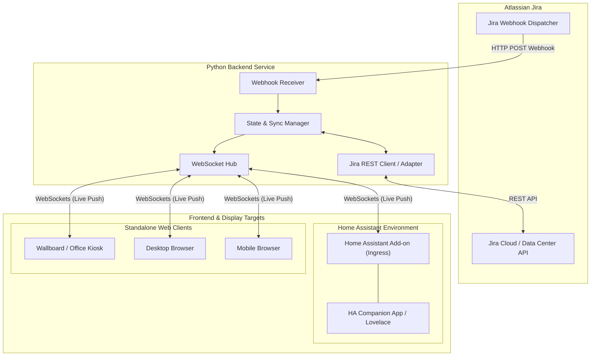

# Home Assistant Jira Dashboard

[](LICENSE)
[](#roadmap)
[](https://my.home-assistant.io/redirect/supervisor_add_addon_repository/?repository_url=https%3A%2F%2Fgithub.com%2Fjacek-marchwicki%2Fhomeassistant-jira)

A high-performance, real-time Jira dashboard built for **Home Assistant** and **standalone web environments**. Designed from the ground up for ambient wall displays, desk workflows, and mobile devices, providing instant UI feedback and live multi-client synchronization.

---

## 🌟 Highlights

- **Dual-Mode Deployment**:
  - **Home Assistant Add-on**: Native Ingress support for zero-config access inside Home Assistant OS, Lovelace panels, and the Home Assistant Companion mobile app.
  - **Standalone Web App**: Fully functional as an independent container or local service for desktop and mobile browsers.
- **Ultra-Responsive UI (Scalable Viewports)**:
  - Effortlessly scales from **large ambient wallboards / 4K displays** down to **compact mobile smartphones**.
  - Touch-optimized interfaces ($\ge 44 \times 44\text{ px}$ targets) with clear visual hierarchy.
- **Optimistic UI (Zero Perceptual Latency) & Offline Outbox**:
  - User actions (moving cards, reordering rank via drag-and-drop, transitioning statuses, editing fields, creating issues) update the interface immediately ($< 50\text{ms}$).
  - Dual-layer offline outbox queuing (client-side Zustand queue + backend SQLite persistent outbox) with automatic background synchronization, exponential backoff retries, and graceful rollback on rejection.
- **LexoRank Drag-and-Drop Issue Ranking**:
  - Natural vertical card reordering in both Kanban Board and Backlog views without card snapping or layout jumping.
  - Fractional alphanumeric LexoRank calculation for collision-free relative ordering, preserved across offline sessions and synced bi-directionally with Jira.
- **Installable Progressive Web App (PWA)**:
  - Installable in browsers on **Android** (Google Chrome, Samsung Internet, Edge, Brave), **iOS** (Safari), and **Desktop**.
  - Includes a Web App Manifest, Service Worker (`sw.js`) with app-shell caching, and adaptive Android maskable icons (192x192 and 512x512).
  - Built-in one-tap "Install App" prompt and touch-friendly mobile installation banner.
- **Real-Time Bidirectional Event Streaming**:
  - Python backend listens for incoming **Jira Webhooks** to capture external updates instantly.
  - Connected browsers receive delta updates in real time via **WebSockets**.
- **Tested & Engineered for Evolution**:
  - Adherence to Clean Architecture, strict typing, and comprehensive unit and integration test suites.

---

## 🛠️ Technology Stack (Phase 2)

See [**ADR-001: Technology Stack Selection**](file:///Users/jacek/Documents/apps/jacek-marchwicki/homeassistant-jira/docs/architecture_decision_records/ADR-001-technology-stack.md) for full context and architectural tradeoffs.

- **Backend** ([`backend/`](file:///Users/jacek/Documents/apps/jacek-marchwicki/homeassistant-jira/backend/)):
  - **Runtime & Framework**: Python 3.10+, **FastAPI**, **Uvicorn** (ASGI).
  - **Data Modeling & Validation**: **Pydantic v2** (Rust-accelerated serialization).
  - **Client**: **HTTPX** (Async HTTP for Jira Cloud REST API).
  - **Package Management & Tooling**: **uv**, **pyproject.toml**, **pytest**, **ruff**, **mypy**.
- **Frontend** ([`frontend/`](file:///Users/jacek/Documents/apps/jacek-marchwicki/homeassistant-jira/frontend/)):
  - **Core**: **React 19**, **TypeScript**, **Vite** (configured with relative `base: './'` for Ingress dynamic proxying).
  - **Styling & Theming**: **Tailwind CSS v4** + Design Tokens with Home Assistant CSS variable bridge.
  - **State & Optimistic Mutations**: **Zustand** (sub-50ms optimistic state updates with rollback queues).
  - **Drag & Drop**: **@dnd-kit** (accessible touch and pointer sensors across mobile, tablet, and PC).
  - **Icons**: **Lucide React**.
  - **Package Manager**: **pnpm**.

---

## 🎨 Design System

The dashboard implements a versatile design system designed for ambient wallboards, desktop monitors, and handheld mobile phones.
👉 [**Complete Design System Specification**](file:///Users/jacek/Documents/apps/jacek-marchwicki/homeassistant-jira/docs/design_system.md)

- **Dark-First Default**: Slate palettes optimized for high-contrast visibility and low-glare wall displays.
- **Home Assistant Theme Bridge**: Seamlessly inherits `--card-background-color`, `--primary-text-color`, and `--accent-color` when hosted in Ingress.
- **Dual Action Modality**: Drag-and-drop across all screens, plus direct one-tap "Mark as Done" buttons and status transition menus so dragging is never strictly required.
- **Touch-Friendly & Accessible**: Minimum $44 \times 44\text{ px}$ targets and dual-coded priority indicators (color + unique icon glyph).

---

## 🏛️ Architecture Overview

The system consists of a Python-based backend service and a modern reactive frontend web application.



---

## 📋 Business Requirements & User Scenarios

For the complete specification of personas, user stories, functional and non-functional requirements, see:
👉 [**Business Requirements Specification**](file:///Users/jacek/Documents/apps/jacek-marchwicki/homeassistant-jira/docs/business_requirements.md)

### Key Workflows:
1. **Ambient Kiosk**: Glancable sprint progress, visual blocker alerts, and touchless live updates for office displays.
2. **Focused Desk Worker**: Instant drag-and-drop issue transitions without the sluggishness of full Jira web pages.
3. **Mobile Triage**: Responsive single-column touch navigation resilient to intermittent connections.
4. **Team Standup**: Shared multi-client synchronization where moves made by any user or Jira automation reflect everywhere instantly.

---

---

## 🚀 Quick Start & Project Setup

### Prerequisites
- **Python**: 3.10 or higher (with [`uv`](https://github.com/astral-sh/uv) recommended, or `pip` / `venv`)
- **Node.js**: 20.x or 22.x
- **Package Manager**: [`pnpm`](https://pnpm.io/) (`corepack enable && corepack prepare pnpm@latest --activate` or `npx pnpm`)

### 1. Backend Setup
```bash
cd backend

# Option A: Using uv (Recommended)
uv sync

# Option B: Using standard Python venv
python3 -m venv .venv
source .venv/bin/activate
pip install --upgrade pip
pip install -e ".[dev]"
```

### 2. Frontend Setup
```bash
cd frontend

# Install dependencies using pnpm
pnpm install
```

---

## 🧪 Running Tests & Quality Checks

The codebase is tested across both the Python backend and TypeScript frontend.

### 1. Run Backend Tests
```bash
# Run with pytest
PYTHONPATH=backend/src pytest backend/tests

# Run with standard Python unittest runner
PYTHONPATH=backend/src python3 -m unittest discover -s backend/tests

# Lint and formatting check
ruff check backend/ scripts/
ruff format --check backend/ scripts/
```

### 2. Run Frontend Tests & Build
```bash
cd frontend

# Run unit tests via Vitest
pnpm test

# Run strict TypeScript typecheck and production build
pnpm build
```

### 3. Run Full-Stack E2E Integration Tests (Fake Jira Test Double)
Runs end-to-end integration tests (Frontend $\leftrightarrow$ WebSockets $\leftrightarrow$ FastAPI $\leftrightarrow$ `FakeJiraClient`), verifying live data loading, optimistic transitions, real-time incoming webhook broadcasting, and error rollbacks without requiring an external Jira instance:
```bash
cd frontend
pnpm test:e2e
```

### 4. Run Visual Screenshot Tests
Runs Playwright visual regression comparisons against golden snapshots in `frontend/tests/screenshots/` with tolerance thresholds (preventing working tree diffs on subpixel flutter):
```bash
cd frontend
# Run visual regression comparison against golden snapshots
pnpm test:visual

# Update golden snapshots after intentional UI modifications
pnpm test:visual:update
```

### 5. Run Local CI Pipeline Runner

The project includes a hybrid CI runner [`scripts/run_ci_locally.py`](file:///Users/jacek/Documents/apps/jacek-marchwicki/homeassistant-jira/scripts/run_ci_locally.py) supporting fast native execution with per-step timing, full test suites, and containerized GitHub Actions simulation:

#### Mode A: Fast Native Checks (Recommended Pre-Commit)
```bash
# Run fast checks (YAML validation, Ruff, pytest, unittest, Vitest, and SPA build) (~1-2s):
./scripts/run_ci_locally.py

# Run with Full-Stack E2E Integration tests:
./scripts/run_ci_locally.py --e2e

# Run with Visual Screenshot tests:
./scripts/run_ci_locally.py --visual

# Run ALL checks (including E2E and visual screenshot suites):
./scripts/run_ci_locally.py --all
```

#### Mode B: Containerized GitHub Actions Simulation (`nektos/act`)
Simulates the exact GitHub Actions environment inside Docker Ubuntu containers matching the 3 parallel CI jobs (`backend`, `frontend`, `e2e-and-visual`). Requires Docker daemon and [`act`](https://github.com/nektos/act) (`brew install act`):
```bash
# Run all CI jobs in Docker
./scripts/run_ci_locally.py --act

# Run only a specific job (e.g., backend matrix, frontend, or e2e-and-visual)
./scripts/run_ci_locally.py --act -j backend
./scripts/run_ci_locally.py --act -j frontend
./scripts/run_ci_locally.py --act -j e2e-and-visual

# Dry-run workflow validation (validates DAG without spinning up containers)
./scripts/run_ci_locally.py --act --dry-run

# View all options
./scripts/run_ci_locally.py --help
```


---

## 💻 Running the App Locally

### Development Mode (Concurrent Servers with Live Reload)

1. **Start the Python Backend Service**:
   ```bash
   # From root or backend directory:
   uv run uvicorn jira_dashboard.presentation.main:app --reload --port 8000
   # or with active virtualenv:
   python3 -m uvicorn jira_dashboard.presentation.main:app --reload --port 8000
   ```
   *The backend will listen on `http://127.0.0.1:8000`.*

2. **Start the Vite Frontend Dev Server**:
   ```bash
   cd frontend
   pnpm dev
   ```
   *The frontend starts at `http://localhost:3000`. Vite automatically proxies `/api` and `/ws` to `http://127.0.0.1:8000`, so API calls and WebSockets work out of the box.*

3. Open **`http://localhost:3000`** in your browser.

### Running with Docker & Docker Compose (Standalone)

You can deploy the complete dashboard as an independent, containerized web service using Docker and Docker Compose:

1. **Configure Environment Variables**:
   ```bash
   cp .env.example .env
   # Edit .env with your Jira instance URL, credentials, and board ID
   ```

2. **Start the Production Service**:
   ```bash
   docker compose up -d
   ```
   *The production application starts at `http://localhost:8000` with non-root security, automated health checks, and embedded React frontend.*

3. **Start Development Container with Hot-Reload**:
   ```bash
   docker compose -f docker-compose.dev.yml up
   ```

---

## 🏠 Installation in Home Assistant

The application is packaged as a **Home Assistant Add-on** with native **Ingress** support, meaning it integrates securely into the Home Assistant interface and Companion mobile apps without exposing external ports.

### ⚡ One-Click Installation (My Home Assistant)

Click the button below to add this repository directly to your Home Assistant instance:

[](https://my.home-assistant.io/redirect/supervisor_add_addon_repository/?repository_url=https%3A%2F%2Fgithub.com%2Fjacek-marchwicki%2Fhomeassistant-jira)

Alternatively, jump directly to the Jira Dashboard add-on store page:

[](https://my.home-assistant.io/redirect/supervisor_addon/?addon=jira_dashboard&repository_url=https%3A%2F%2Fgithub.com%2Fjacek-marchwicki%2Fhomeassistant-jira)

---

### Add-on Manifest & Packaging
The repository specification is configured in [`repository.yaml`](file:///Users/jacek/Documents/apps/jacek-marchwicki/homeassistant-jira/repository.yaml), add-on manifest at [`addon/config.yaml`](file:///Users/jacek/Documents/apps/jacek-marchwicki/homeassistant-jira/addon/config.yaml), multi-arch builder configuration at [`addon/build.yaml`](file:///Users/jacek/Documents/apps/jacek-marchwicki/homeassistant-jira/addon/build.yaml), container build definition at [`addon/Dockerfile`](file:///Users/jacek/Documents/apps/jacek-marchwicki/homeassistant-jira/addon/Dockerfile), automated publishing workflow at [`.github/workflows/publish-images.yml`](file:///Users/jacek/Documents/apps/jacek-marchwicki/homeassistant-jira/.github/workflows/publish-images.yml), and integrated documentation at [`addon/DOCS.md`](file:///Users/jacek/Documents/apps/jacek-marchwicki/homeassistant-jira/addon/DOCS.md).

- **Pre-Built Multi-Architecture Images (GHCR)**: Home Assistant installations pull pre-compiled container images directly from GitHub Container Registry (`image: ghcr.io/jacek-marchwicki/homeassistant-jira-{arch}`) across official 64-bit architectures (`aarch64`, `amd64`). This eliminates on-device compilation overhead, installing in seconds on low-power hardware (such as Raspberry Pi 4/5 or Home Assistant Green).
- **Local Source Builds (Zero Git Requirement)**: Both the root [`Dockerfile`](file:///Users/jacek/Documents/apps/jacek-marchwicki/homeassistant-jira/Dockerfile) and [`addon/Dockerfile`](file:///Users/jacek/Documents/apps/jacek-marchwicki/homeassistant-jira/addon/Dockerfile) copy local workspace files directly (`COPY frontend/ ...`, `COPY backend/ ...`). You can build and run containers locally completely offline without requiring a Git repository or network access:
  ```bash
  # Build Home Assistant Add-on image locally
  docker build -t jira-addon:local -f addon/Dockerfile .

  # Build standalone container image locally
  docker build -t jira-dashboard:local -f Dockerfile .
  ```

### Method 1: Installing via Home Assistant Add-on Store (Repository)
If the one-click button above is not used, add the repository manually:
1. In Home Assistant, navigate to **Settings** > **Add-ons** > **Add-on Store**.
2. Click the three vertical dots (top right) and select **Repositories**.
3. Add this repository URL:
   ```
   https://github.com/jacek-marchwicki/homeassistant-jira
   ```
4. Find **Jira Dashboard** in the store, click **Install** (the pre-built image downloads instantly).

### Method 2: Local Development / Manual Installation
1. On your Home Assistant host (via Samba, SSH, or Samba Share), open the `/addons/` directory.
2. Copy or symlink the repository into `/addons/jira_dashboard/`.
3. In Home Assistant, go to **Settings** > **Add-ons** > **Add-on Store** > three dots > **Check for updates**.
4. The local **Jira Dashboard** add-on will appear under the "Local Add-ons" section. Click **Install**.

### Configuration Options
In the add-on's **Configuration** tab, enter your Jira connection settings:

| Option | Type | Required | Description | Example |
|---|---|---|---|---|
| `jira_url` | URL | Yes | Base URL of your Jira Cloud instance | `https://mycompany.atlassian.net` |
| `jira_email` | String | Yes | Your Atlassian account email address | `alex@mycompany.com` |
| `jira_api_token` | Password | Yes | Jira Cloud API Token ([generate here](https://id.atlassian.com/manage-profile/security/api-tokens)) | `ATATT3xFfGF0...` |
| `jira_board_id` | String | No | Target Jira Board ID (optional, defaults to primary board) | `42` |
| `polling_interval_seconds` | Integer | No | Fallback polling interval in seconds (default: `60`, `0` disables) | `60` |

### Launching the Dashboard
1. Go to the **Info** tab, toggle **Show in sidebar**, and click **Start**.
2. Click **Open Web UI** (or click **Jira** in the Home Assistant left sidebar).
3. The dashboard loads seamlessly inside Home Assistant through Ingress, automatically matching your Home Assistant theme!

---

## 🤖 AI Agent & Developer Guidelines

If you are an AI assistant or human contributor developing this project, please consult:
👉 [**AGENTS.md**](file:///Users/jacek/Documents/apps/jacek-marchwicki/homeassistant-jira/AGENTS.md)

This file defines coding standards, testing requirements, architectural boundaries, and branch/commit conventions.

---

### 🗺️ Roadmap & Phases

The complete architectural phases, delivered features, and development roadmap have been extracted into a dedicated document:

👉 **[View Full Roadmap & Evolutionary Phases](docs/roadmap_and_phases.md)**

*Recent Milestones*:
- **Interactive Date Picker & Portal Architecture**: Portaled calendar popover escaping modal boundaries, viewport collision detection, quick year jumping (`<<` / `>>`), and native year/month dropdowns.
- **Consistent Modal Date Ordering**: "Start Date" displayed before "Due Date" across both Create Issue and Edit Issue dialogs.
- **Home as Usual Section**: Dedicated grouping in the "Ready" column for daily active recurring tasks (`recreate_after == "1d"`).
- **AI Feature Workflow Skill**: Integrated developer skill ([`.agents/skills/implement-feature-workflow/SKILL.md`](.agents/skills/implement-feature-workflow/SKILL.md)) orchestrating full-cycle implementation with worktrees, tests, offline reactivity, and visual regression.

---

## 📄 License

This project is licensed under the **Apache License, Version 2.0**.
See the [LICENSE](LICENSE) file for the full license text and copyright notices.


