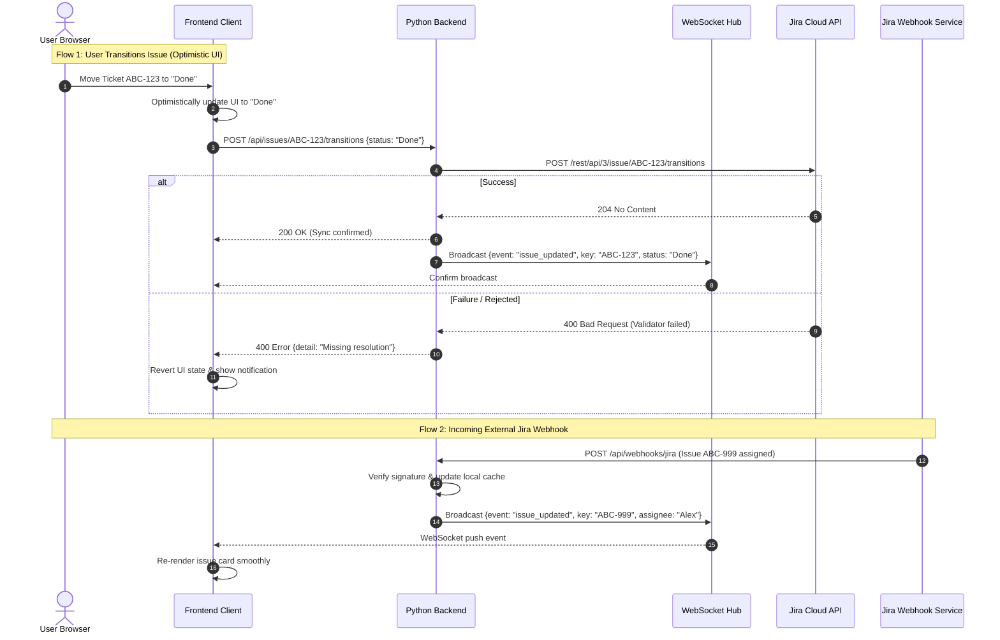

# Business Requirements Specification: Home Assistant Jira Dashboard

## 1. Executive Summary & Vision

The **Home Assistant Jira Dashboard** is a lightweight, responsive, real-time web application engineered to bridge Jira sprint tracking and task management into smart environments and personal workflows. 

The application serves a dual deployment purpose:
1. **Home Assistant Add-on**: Integrated directly into Home Assistant OS / Supervised environments with native Ingress support, enabling secure access through Home Assistant dashboards and companion apps without port forwarding.
2. **Standalone Web Application**: Capable of running independently via Docker or local process for users who want a clean, lightning-fast Jira dashboard without requiring Home Assistant.

A core tenet of the application is **zero perceptual latency**: user interactions (moving tickets, transitioning statuses, updating assignments) reflect instantly in the user interface via **Optimistic UI**, while asynchronous synchronization ensures updates are reliably committed to Jira. Furthermore, real-time incoming changes from Jira are ingested via webhooks and immediately broadcasted to all active browsers over **WebSockets**.

---

## 2. Personas & Core User Scenarios

### Persona 1: Wall Display & Ambient Office Kiosk ("The Ambient Observer")
- **Device**: Wall-mounted smart display, tablet, or secondary TV in an office/home workspace.
- **Context**: Screen runs continuously without frequent direct touch input.
- **Needs**:
  - Clear, readable typography and high-contrast card layouts visible from a distance.
  - Auto-refreshing state that never goes stale or requires manual browser reloads.
  - Visual indicators for blocked, high-priority, or SLA-breaching issues.
  - Kiosk/fullscreen mode that hides unnecessary navigation chrome.

### Persona 2: Desk Worker ("The Focused Producer")
- **Device**: Desktop or laptop workstation with multiple monitors.
- **Context**: Managing daily tasks and sprint progress alongside IDEs and communication tools.
- **Needs**:
  - Rapid navigation and quick filters (e.g., "Assigned to Me", "In Progress", "Code Review").
  - Instant drag-and-drop or hotkey-based issue status transitions.
  - Minimal resource footprint compared to heavy Jira web pages.

### Persona 3: Mobile Triage ("The On-The-Go Contributor")
- **Device**: Smartphone running Home Assistant Mobile Companion app or mobile web browser.
- **Context**: Triaging alerts or quickly checking sprint status while away from the desk.
- **Needs**:
  - Adaptive single-column or compact list view with touch targets $\ge 44 \times 44$ px.
  - Graceful handling of intermittent or fluctuating mobile connections.
  - Fast status changes without deep navigation hierarchies.

### Persona 4: Co-located / Distributed Team Member ("The Real-time Collaborator")
- **Device**: Any client device when multiple team members view the board simultaneously.
- **Context**: Standup meetings or collaborative planning.
- **Needs**:
  - Live synchronization: when a teammate or Jira automation updates an issue, all connected screens reflect the change within milliseconds via WebSockets without page reload.

---

## 3. Functional Requirements (FR)

### FR-1: Board & Issue Visualization
- **FR-1.1 Kanban / Sprint Board View**: Display issues organized by status columns according to Jira workflow mappings.
- **FR-1.2 Compact List View**: Offer an alternative tabular/list layout optimized for dense task scanning and mobile triage.
- **FR-1.3 Issue Details**: Display essential ticket metadata: Key, Summary, Issue Type icon, Priority indicator, Assignee avatar/name, Story Points / Estimates, and Status badge.
- **FR-1.4 Visual Highlights**: Highlight blocked items, overdue dates, or escalated priorities with customizable visual tags.

### FR-2: User Interactions & Optimistic UI
- **FR-2.1 Instant Transitions**: Users can transition issues between status columns (via drag-and-drop or interactive status selector).
- **FR-2.2 Optimistic Execution**: The user interface MUST update immediately upon action without waiting for network confirmation from the backend or Jira API.
- **FR-2.3 Sync Queue & Status Indicators**: A non-intrusive status indicator shows when an action is syncing, confirmed, or failed.
- **FR-2.4 Reversion & Reconciliation**: If Jira rejects a transition (e.g., workflow validator failure, missing mandatory field, permission error), the UI gracefully rolls back the item to its previous state and presents an actionable error notification.

### FR-3: Real-Time Jira Ingestion & WebSockets
- **FR-3.1 Webhook Receiver**: The Python backend provides a secure webhook endpoint to receive real-time notifications from Jira Cloud (and Jira Data Center) for issue creation, status transitions, updates, and deletions.
- **FR-3.2 Fallback Polling**: Configurable polling fallback ensures updates are captured even if webhook delivery is not directly accessible (e.g., behind strict NAT without public webhook ingress).
- **FR-3.3 WebSocket Distribution**: The backend maintains persistent WebSocket connections to all active browser clients, broadcasting delta updates as JSON events.
- **FR-3.4 State Synchronization Protocol**: Clients exchange a sequence/version token to detect missed events across reconnections and fetch differential state updates.

### FR-4: Filtering, Searching & Customization
- **FR-4.1 Quick Filters**: One-tap toggles for "My Issues", "Only Active Sprint", "Recently Updated", and "Blockers".
- **FR-4.2 Text Search & JQL**: Quick client-side filtering by issue key/text and server-side JQL query execution.
- **FR-4.3 Board Switching**: Support switching between configured Jira boards or project filters.

### FR-5: Dual Deployment & Configuration
- **FR-5.1 Home Assistant Ingress**: Full compliance with Home Assistant Add-on architecture, supporting dynamic Ingress base paths and seamless authentication passing.
- **FR-5.2 Standalone Mode**: Configurable via environment variables or YAML configuration file, enabling execution as a standard Docker container or direct process.
- **FR-5.3 Jira Authentication**:
  - Primary: Jira Cloud REST API (Domain, Email, API Token).
  - Extensible: Jira Data Center / Server (Personal Access Token / Bearer).

---

## 4. Non-Functional Requirements (NFR)

### NFR-1: Performance & Latency
- **NFR-1.1 UI Reaction Time**: Client-side response to user interaction MUST be $< 50$ ms.
- **NFR-1.2 Real-time Broadcast Latency**: Time elapsed from Jira webhook receipt at the backend to WebSocket broadcast arrival at the client MUST be $< 200$ ms under normal network conditions.
- **NFR-1.3 Lightweight Bundle**: Frontend static assets should remain lean with fast initial load ($< 1.5$ s on standard broadband).

### NFR-2: Scalability & Responsive Design
- **NFR-2.1 Breakpoint Adaptability**: Layout smoothly adapts across breakpoints:
  - Mobile portrait: $320\text{px} - 640\text{px}$
  - Tablet / Foldable: $641\text{px} - 1024\text{px}$
  - Desktop / Laptop: $1025\text{px} - 1920\text{px}$
  - Wallboard / 4K Kiosk: $> 1920\text{px}$
- **NFR-2.2 Touch-Friendly Targets**: All actionable buttons, drag handles, and dropdowns maintain a touch bounding box $\ge 44 \times 44$ px.

### NFR-3: Reliability, Offline & Reconnection
- **NFR-3.1 WebSocket Auto-Reconnect**: Frontend automatically reconnects upon network interruption using exponential backoff with jitter (1s, 2s, 4s, up to 30s).
- **NFR-3.2 Resilient State Recovery**: On reconnection, client revalidates the current board state to guarantee consistency.
- **NFR-3.3 Backend Health Checks**: Expose `/health` and `/ready` endpoints for container orchestration and Home Assistant supervision.

### NFR-4: Security & Privacy
- **NFR-4.1 Secret Management**: Jira credentials (API tokens, PATs) are stored strictly server-side and never exposed to client browsers.
- **NFR-4.2 Webhook Verification**: Support secret token / HMAC signature verification on incoming Jira webhooks.
- **NFR-4.3 Least Privilege**: Only request required Jira scopes (read issues, write issue transitions).

### NFR-5: Testability & Software Engineering Best Practices
- **NFR-5.1 Test Coverage**: High test coverage across business logic:
  - Unit tests for domain models, state machines, and reconciliation rules.
  - Integration tests for Jira API clients, Webhook handlers, and WebSocket broadcast pipelines.
  - Frontend component and state synchronization tests.
- **NFR-5.2 Mockability**: Complete local testability without needing an active Jira instance via mock HTTP/webhook servers and stubbed providers.
- **NFR-5.3 Clean Architecture**: Strict decoupling between domain logic, infrastructure/API clients, and delivery mechanisms.

---

## 5. Architectural Event & Sync Flow

---

## 6. Success Criteria & Verification Milestones

1. **Phase 1: Project Setup & Alignment (Current)**
   - Business requirements specified and approved.
   - Standardized developer & agent rules documented in `AGENTS.md`.
   - Technology-agnostic vision in `README.md`.
   - Clean Git repository initialized.

2. **Phase 2: Technology Selection (Next Step)**
   - Evaluation and selection of Python backend framework (e.g., FastAPI, aiohttp, Litestar) against WebSocket performance, Ingress compatibility, and testability.
   - Evaluation and selection of modern Frontend framework (e.g., React, Vue, Svelte) against bundle size, responsive capabilities, and optimistic state handling.

3. **Phase 3: Core Implementation & Verification**
   - Jira API adapter & webhook ingestion.
   - WebSocket broadcast engine.
   - Responsive UI with optimistic transitions.
   - Full automated test suite (unit + integration).
   - Home Assistant Add-on packaging with Ingress support.
