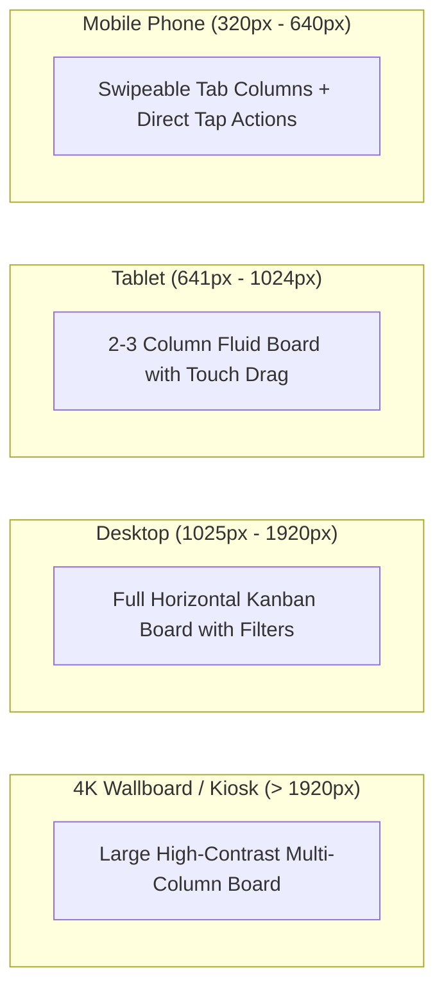

# Design System Specification: Home Assistant Jira Dashboard

## 1. Vision & Core Principles

The **Home Assistant Jira Dashboard Design System** provides a unified visual and interaction language designed for extreme versatility. It adapts flawlessly from **wall-mounted ambient displays and 4K TVs** down to **handheld smartphones running the Home Assistant Companion App**, while maintaining a lightning-fast, zero-perceptual-latency feel.

### Core Principles

1. **Glanceability First (The 10-Foot & 1-Foot Rule)**:
   - *10-Foot Rule*: On wallboards and ambient kiosks, ticket status, assignees, priorities, and blockers must be recognizable from across the room at a glance.
   - *1-Foot Rule*: On mobile phones and desktop displays, information density is comfortable, clear, and scannable without visual fatigue.
2. **Zero-Latency Interaction (Optimistic UI)**:
   - Every user action (dragging a card, clicking a status button, reassigning) updates the interface immediately ($< 50\text{ms}$).
   - Synchronization with the server is indicated through subtle, ambient micro-states (e.g. non-intrusive edge glow or status pill) without modal blocking or layout shifting.
3. **Dual Action Modality (Drag-and-Drop + Direct Actions)**:
   - **Full Drag-and-Drop**: Available across all screen sizes (mobile, tablet, desktop) using touch and pointer sensors.
   - **Non-Drag Quick Actions**: Dragging is **never strictly required**. Cards feature a direct one-tap **"Mark as Done"** button and an accessible **Status Transition Menu** for effortless single-tap operations.
4. **Dark-First with Native Home Assistant Theme Harmony**:
   - Default theme is a modern, deep dark palette tailored for wallboards, OLED displays, and smart home dashboards.
   - Automatic integration with Home Assistant theme CSS variables when running inside Ingress.
   - Built-in manual Light / Dark toggle for standalone desktop users.
5. **Touch Ergonomics & Accessibility**:
   - Minimum interactive bounding box: $\ge 44 \times 44\text{ px}$.
   - Dual-coding for critical status (color + icon glyph) to guarantee WCAG 2.1 AA accessibility for color-blind users.

---

## 2. Design Tokens

### 2.1 Color Palette

The color system uses CSS custom properties with automatic fallback to Home Assistant theme variables when present.

```css
:root {
  /* Base Surface Tokens (Dark Default) */
  --jira-canvas: #0f172a;           /* Canvas background (slate-900) */
  --jira-surface: #1e293b;          /* Container / Column background (slate-800) */
  --jira-surface-elevated: #334155; /* Card background (slate-700) */
  --jira-surface-hover: #475569;    /* Card hover state (slate-600) */
  --jira-border: #334155;           /* Subtle borders */
  --jira-border-subtle: #1e293b;    /* Hairline dividers */

  /* Text & Content Tokens */
  --jira-text-primary: #f8fafc;     /* Highest contrast body & titles (slate-50) */
  --jira-text-secondary: #94a3b8;   /* Metadata, issue keys, labels (slate-400) */
  --jira-text-muted: #64748b;       /* Timestamps, disabled text (slate-500) */
  --jira-text-inverse: #0f172a;     /* Text on bright badges */

  /* Accent & Interactive */
  --jira-primary: #3b82f6;          /* Action blue (blue-500) */
  --jira-primary-hover: #2563eb;    /* Active state (blue-600) */
  --jira-focus-ring: #60a5fa;       /* Focus outline (blue-400) */
}
```

#### Home Assistant Theme Bridge
When running inside Home Assistant Ingress, the design system maps to Home Assistant's native CSS variables:

| Design System Token | Standalone Fallback | Home Assistant Variable Bridge |
|---|---|---|
| `--jira-canvas` | `#0f172a` (Dark) / `#f8fafc` (Light) | `var(--primary-background-color, #0f172a)` |
| `--jira-surface` | `#1e293b` (Dark) / `#ffffff` (Light) | `var(--card-background-color, #1e293b)` |
| `--jira-surface-elevated`| `#334155` (Dark) / `#f1f5f9` (Light) | `var(--ha-card-background, #334155)` |
| `--jira-text-primary` | `#f8fafc` (Dark) / `#0f172a` (Light) | `var(--primary-text-color, #f8fafc)` |
| `--jira-text-secondary` | `#94a3b8` (Dark) / `#475569` (Light) | `var(--secondary-text-color, #94a3b8)` |
| `--jira-border` | `#334155` (Dark) / `#e2e8f0` (Light) | `var(--divider-color, #334155)` |
| `--jira-primary` | `#3b82f6` | `var(--accent-color, #3b82f6)` |

#### Semantic Jira Status Categories
Jira statuses are grouped into standardized workflow categories with dedicated semantic tokens:

| Category | Hex (Dark Mode) | Hex (Light Mode) | Meaning & Default Workflow States |
|---|---|---|---|
| **To Do / Open** | `#64748b` (slate-500) | `#475569` (slate-600) | Backlog, Open, To Do, Ready for Dev |
| **In Progress** | `#3b82f6` (blue-500) | `#2563eb` (blue-600) | In Progress, Active, In Development |
| **In Review** | `#8b5cf6` (purple-500) | `#7c3aed` (purple-600) | In Review, QA, Testing, Code Review |
| **Done** | `#22c55e` (green-500) | `#16a34a` (green-600) | Done, Closed, Resolved, Deployed |
| **Blocked / Critical**| `#ef4444` (red-500) | `#dc2626` (red-600) | Blocked, Impeded, Waiting for Info |

#### Priority Dual-Coding (Glyphs + Colors)
To ensure accessibility, priorities are never indicated by color alone:

| Priority | Color Token | Hex | Glyph / Icon |
|---|---|---|---|
| **Highest / Blocker** | `var(--jira-priority-highest)` | `#ef4444` | Double Chevron Up (`ChevronsUp`) |
| **High** | `var(--jira-priority-high)` | `#f97316` | Chevron Up (`ChevronUp`) |
| **Medium** | `var(--jira-priority-medium)` | `#eab308` | Equal / Horizontal Bars (`Equal`) |
| **Low** | `var(--jira-priority-low)` | `#3b82f6` | Chevron Down (`ChevronDown`) |
| **Lowest** | `var(--jira-priority-lowest)` | `#94a3b8` | Double Chevron Down (`ChevronsDown`) |

---

### 2.2 Typography Scale

The font family defaults to `Inter, -apple-system, BlinkMacSystemFont, "Segoe UI", Roboto, sans-serif`.

| Token | Size | Line Height | Weight | Usage |
|---|---|---|---|---|
| `text-2xs` | 10px / 0.625rem | 14px | Medium (500) | Story point pills, dense metadata |
| `text-xs` | 12px / 0.75rem | 16px | Medium (500) | Issue key (e.g. `ABC-123`), time elapsed |
| `text-sm` | 14px / 0.875rem | 20px | Regular (400) / SemiBold (600) | Card summary (standard view), filter pills |
| `text-base` | 16px / 1.0rem | 24px | Medium (500) | Card summary (wallboard mode), input fields |
| `text-lg` | 18px / 1.125rem | 28px | SemiBold (600) | Column titles, issue count badges |
| `text-xl` | 20px / 1.25rem | 28px | Bold (700) | Section headings, modal headers |
| `text-2xl` | 24px / 1.5rem | 32px | Bold (700) | Board name, kiosk wallboard headers |

---

### 2.3 Spacing, Borders & Shadows

- **Grid Unit**: 4px base (`p-1` = 4px, `p-2` = 8px, `p-3` = 12px, `p-4` = 16px, `p-6` = 24px).
- **Border Radii**:
  - Small elements (pills, badges): `rounded-md` (6px)
  - Issue cards: `rounded-lg` (8px)
  - Columns & Modals: `rounded-xl` (12px)
  - Avatar badges & Action circles: `rounded-full`
- **Elevation & Shadows**:
  - Card Default: `shadow-sm` (`0 1px 2px 0 rgba(0, 0, 0, 0.25)`)
  - Card Hover: `shadow-md` (`0 4px 6px -1px rgba(0, 0, 0, 0.3)`)
  - Card Dragging (Active): `shadow-2xl` (`0 20px 25px -5px rgba(0, 0, 0, 0.5)`), scale 1.02.
  - Modals & Sheets: `shadow-2xl` with backdrop blur (`backdrop-blur-sm`).

---

## 3. Component Specifications

### 3.1 Issue Card (`<IssueCard />`)

The central component of the dashboard, optimized for fast scanning, drag-and-drop, and direct action.

```
+--------------------------------------------------------------+
| [Type Icon]  PROJ-1234                           [Mark Done] |
| Refactor authentication pipeline for Ingress                 |
|                                                              |
| [P: High]  [3 pts]               [Syncing...]  (Assignee: JM)|
+--------------------------------------------------------------+
```

- **Top Bar**:
  - Issue Type Icon (Story, Bug, Task, Subtask).
  - Issue Key (`PROJ-1234`) with click-to-copy or link to Jira.
  - **Quick Action ("Mark Done")**: A dedicated, accessible button (`min-h-[44px] min-w-[44px]` touch target) that transitions the issue directly to the *Done* status without dragging.
  - **Quick Transition Menu Trigger**: A "..." or status indicator pill that opens an instant status picker sheet/popover.
- **Body**:
  - Summary text (truncated to 2 or 3 lines with ellipsis).
  - Epic / Component label pill (optional, configurable).
- **Footer**:
  - Priority Glyph + Color (e.g. High: Orange Chevron Up).
  - Story Points / Estimate badge.
  - Optimistic Sync Status Indicator (e.g. subtle pulsing sync ring or checkmark).
  - Assignee Avatar (image with initials fallback).

### 3.2 Kanban Column (`<KanbanColumn />`)

A droppable vertical container representing a workflow stage.

- **Header**:
  - Column Title (e.g., "In Progress").
  - Issue Count Pill (e.g., `4`).
  - Work-in-Progress (WIP) limit alert (visual badge if limit exceeded).
- **Droppable Area**:
  - Minimum height to allow easy dropping into empty columns.
  - Visual drop indicator (accent border highlight) when a dragged card hovers over the drop target.
- **Mobile Collapse Toggle**: On mobile portrait screens, columns can be collapsed or switched via a top segmented control tab bar.

### 3.3 Direct Quick Action & Transition Sheet (`<TransitionSheet />`)

Provides an alternative to drag-and-drop:
- **On Desktop**: Hovering an issue card reveals a quick "✓ Mark Done" button and a small status badge dropdown.
- **On Mobile / Touch**: Tapping the card status badge or action trigger opens a bottom sheet showing all valid transitions (e.g., `To Do`, `In Progress`, `In Review`, `Done`). Tapping any option immediately transitions the card optimistically.

### 3.4 Connection & Sync Status Indicator (`<SyncStatusPill />`)

Positioned in the header bar or floating bottom corner:
- 🟢 **Live**: WebSocket connected; Jira webhook stream active.
- 🟡 **Syncing (n)**: $n$ optimistic mutations currently in flight to Jira backend.
- 🔴 **Reconnecting**: WebSocket dropped; actively attempting reconnect with exponential backoff.
- ⚠️ **Sync Error**: A previous action failed Jira validation; displays a rollback notification with retry option.

### 3.5 Quick Filter Bar (`<QuickFilterBar />`)

Horizontal scrollable pill container:
- "Only My Issues"
- "Active Sprint"
- "Blockers Only"
- "High / Highest Priority"
- Free-text search input (filters cards in real-time as user types).

---

## 4. Viewport Layout Specifications



### 4.1 Wallboard / Kiosk Mode ($> 1920\text{px}$)
- **Mode Toggle**: Dedicated fullscreen kiosk toggle.
- **Layout**: All columns fit horizontally on the screen without horizontal scrolling.
- **Font Scale**: Scales up 25–40% (`text-lg` for card titles, `text-2xl` for headers) for comfortable reading from 3–5 meters away.
- **Ambient Black**: Background switches to true black (`#000000`) for OLED displays, minimizing power and glare in home/office environments.

### 4.2 Desktop Workstation ($1025\text{px} - 1920\text{px}$)
- **Layout**: Standard multi-column Kanban board with horizontal scrolling if columns exceed viewport width.
- **Interactions**: Mouse drag-and-drop, card click for detail modal, hover-reveal quick action buttons.

### 4.3 Tablet ($641\text{px} - 1024\text{px}$)
- **Layout**: 2 to 3 visible columns with smooth horizontal touch-panning.
- **Interactions**: Touch drag-and-drop with 150ms hold delay to distinguish from page scroll.

### 4.4 Mobile Phone ($320\text{px} - 640\text{px}$)
- **Layout**: 
  - Segmented top tab bar representing columns (`To Do (3)`, `In Progress (2)`, `Done (5)`).
  - Single active column displayed full-width, or horizontal swipe between columns.
- **Interactions**:
  - Touch drag-and-drop available between visible column items or onto adjacent tab headers.
  - Direct one-tap **"Mark as Done"** checkmark and **"Change Status"** bottom sheet.

---

## 5. Micro-Interactions & Optimistic Motion

- **Card Pickup**: Scales to $1.02 \times$, elevation increases to `shadow-2xl`, subtle cursor grab icon.
- **Card Placement / Drop**: Smooth ease-out transition ($150\text{ms}$, `cubic-bezier(0.2, 0, 0, 1)`).
- **Optimistic State Feedback**:
  - When dropped into a new column, the card appears immediately in the target column.
  - A subtle 2px pulsing border (`#3b82f6`) or bottom sync bar indicates pending Jira commit.
  - Upon server confirmation ($200\text{ OK}$), the border gently transitions to neutral.
- **Rollback on Error**:
  - If the backend or Jira API returns an error (e.g. validator failed, permission denied), the card smoothly animates back to its original column ($250\text{ms}$).
  - A non-blocking toast banner displays: *"Unable to move ABC-123 to Done: Jira requires a resolution field."*
